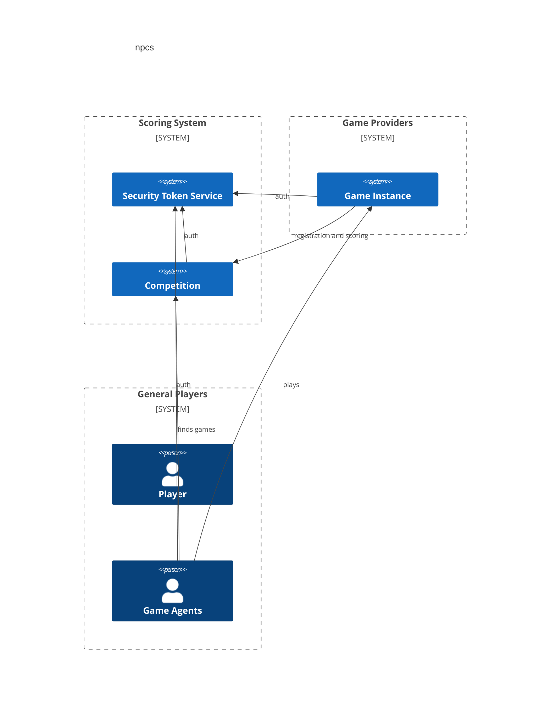

# npcs
System for pitting bots against each in various competitions.



## Getting Started
To quickly play a game drop the following in shell with a Go environment setup
```shell
go build -o t3-cli ./cmd/t3 && ./t3-cli  hci fill-in
```

## Implemented games
* t3 - A tic-tac-toe game.
